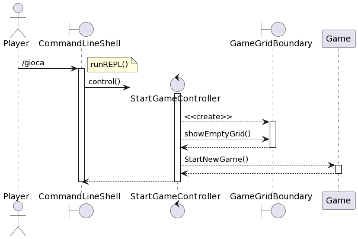

# Progetto Minsky Ingegneria del software a.a. 21/22
# Report
## Indice
1. Introduzione
2. Modello di dominio
3. Requisiti specifici:
   1. Requisiti funzionali
   2. Requisiti non funzionali
4. OO Design
   1. Selezione Parola Segreta
   2. Inizio Nuova Partita
   3. Esecuzione del tentativo

# 1. Introduzione

Il progetto riguarda le realizzazione del famoso gioco Wordle, gioco in cui bisogna indovinare in sei tentativi una parola segreta di cinque lettere. 
Lo svolgimento del lavoro è stato diviso in tre fasi principali dette Sprint, che si ponevano degli obbiettivi:

- Sprint 0: dimostrare familiarità con GitHub e il processo agile.
- Sprint 1: giocare in modo basico.

Il tempo di realizzazione dello Sprint 0 è stato dal 28 Marzo 2022 al 19 Aprile 2022, per quanto riguarda lo Sprint 1 è stato dal 6 Maggio 2022 al 20 Maggio 2022.
Il lavoro è stato suddiviso equamente tra tutti i contributori del progetto:
Proscia Vito, Quagliarella Vincenzo, Romanazzi Raffaello, Tancrini Stefano, Venezia Mario.

# 2. Modello di dominio

# 3. Requisisti specifici
## 3.1 Requisiti funzionali
Requisito funzionale 1 : **Selezione parola segreta**

Come paroliere voglio impostare una parola segreta manualmente. Al comando:
> `/nuova <parola>`

l’applicazione risponde:
    
- _Parola segreta troppo corta_ se i caratteri sono inferiori a quelli del gioco.

- _Parola segreta troppo lunga_ se i caratteri sono superiori a quelli del gioco.

- _Parola segreta non valida_ se ci sono caratteri che non corrispondono a lettere dell’alfabeto.
    
altrimenti:

- l’applicazione risponde con OK e memorizza la parola fino a chiusura applicazione.
    
È possibile cambiare la parola durante una sessione di gioco anche senza uscire dall’applicazione.
#
Requisito funzionale 2 : **Visualizzazione parola segreta**

Come paroliere voglio mostrare la parola segreta. Al comando:

> `/mostra`

l’applicazione risponde visualizzando la parola segreta.
#
Requisito funzionale 3: **Visualizzazione Help**

Come giocatore voglio mostrare l'help con elenco comandi. Al comando:

> `/help` o invocando l'app con flag `--help` o `-h`

il risultato è una descrizione concisa, che normalmente appare all'avvio del programma, seguita dalla lista di comandi disponibili, uno per riga, come da esempio successivo:

- gioca

- esci

- ...
#
Requisito funzionale 4 : **Inizio nuova partita**

Come giocatore voglio iniziare una nuova partita. Al comando
> `/gioca`

se nessuna partita è in corso l'app mostra la matrice dei tentativi vuota, ma senza mostrare la tastiera, e si predispone a ricevere il primo tentativo o altri comandi.

Se la parola segreta non è stata impostata l’applicazione risponde: *Parola segreta mancante*
#
Requisito funzionale 5: **Abbandono della partita**

Come giocatore voglio abbandonare la partita. Al comando:
> `/abbandona`

l’app chiede conferma:

- se la conferma è positiva, l'app comunica l’abbandono.
- se la conferma è negativa, l'app si predispone a ricevere un altro tentativo o altri comandi.

#

Requisito funzionale 6 : **Chiusura del gioco**

Come giocatore voglio chiudere il gioco. Al comando:
> `/esci`

l’app chiede conferma:

- se la conferma è positiva, l'app si chiude restituendo un zero exit code.
- se la conferma è negativa, l'app si predispone a ricevere nuovi tentativi o comandi.

#

Requisito funzionale 7 : **Esecuzione del tentativo**

Come giocatore voglio effettuare un tentativo per indovinare la parola segreta.

Digitando caratteri sulla tastiera e invio

l’applicazione risponde:

- Tentativo incompleto se i caratteri sono inferiori a quelli della parola segreta

- Tentativo eccessivo se i caratteri sono superiori a quelli della parola segreta

- Tentativo non valido se ci sono caratteri che non corrispondono a lettere dell’alfabeto

altrimenti

riempiendo la prima riga libera della matrice dei tentativi con i caratteri inseriti e colorando lo sfondo di verde se la lettera è nella parola segreta e nel posto giusto, di giallo se la lettera è nella parola segreta ma nel posto sbagliato e di grigio se la lettera non è nella parola segreta.

Se le lettere sono tutte verdi l’applicazione risponde

- Parola segreta indovinata Numero tentativi: <…> e si predispone a nuovi comandi

Se il tentativo fallito è l’ultimo possibile , l’applicazione risponde

- Hai raggiunto il numero massimo di tentativi. La parola segreta è <…> e si predispone a nuovi comand
#

## 3.2 Requisisti non funzionali
Requisito non funzionale 1 : 

il container docker dell’app deve essere eseguito da terminali che supportano Unicode con encoding UTF-8 o UTF-16.
Elenco di terminali supportati:

Linux:

- terminal

Mac OS:

- terminal

Windows:

- Powershell

- Git Bash (in questo caso il comando Docker ha come prefisso winpty; es: winpty docker -it ....)

**Comando per l’esecuzione del container**
Dopo aver eseguito il comando docker pull copiandolo da GitHub Packages, Il comando Docker da usare per eseguire il
container contenente l’applicazione è:

> docker run --rm -it ghcr.io/softeng2122-inf-uniba/wordle-minsky2122:latest

# 4. OO Design

## 4.1 Selezione Parola Segreta

### Diagramma delle classi

### Diagramma di sequenza

## 4.2 Inizio Nuova Partita

### Diagramma delle classi

### Diagramma di sequenza

## 4.3 Esecuzione del tentativo

### Diagramma delle classi

### Diagramma di sequenza

