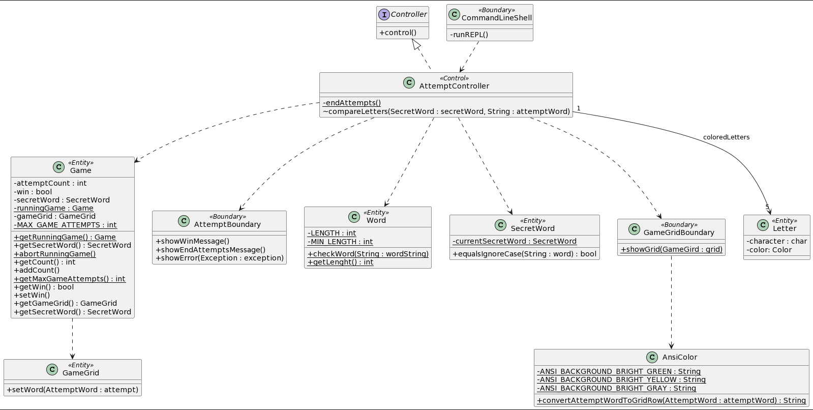

# Progetto Minsky Ingegneria del software a.a. 21/22
# Report
## Indice
1. Introduzione
2. Modello di dominio
3. Requisiti specifici:
   1. Requisiti funzionali
   2. Requisiti non funzionali
4. System Design
5. OO Design
   1. Selezione Parola Segreta
   2. Inizio Nuova Partita
   3. Esecuzione del tentativo
6. Riepilogo del test
7. Manuale Utente
8. Processo di sviluppo e organizzazione del lavoro
9. Analisi retrospettiva
   1. Sprint 1

# 1. Introduzione

Il progetto riguarda le realizzazione del famoso gioco Wordle, gioco in cui bisogna indovinare in sei tentativi una parola segreta di cinque lettere. 
Lo svolgimento del lavoro è stato diviso in tre fasi principali dette Sprint, che si ponevano degli obbiettivi:

- Sprint 0: dimostrare familiarità con GitHub e il processo agile.
- Sprint 1: giocare in modo basico.
- Sprint 2: assicurare la qualità del lavoro svolto.

Il tempo di realizzazione dello Sprint 0 è stato dal 28 Marzo 2022 all' 11 Aprile 2022, lo Sprint 1 è stato dal 6 Maggio 2022 al 20 Maggio 2022 e per quanto riguarda lo Sprint 2 dal 30 Maggio 2022 al 14 Giugno 2022.
Il lavoro è stato suddiviso equamente tra tutti i contributori del progetto :
Proscia Vito, Quagliarella Vincenzo, Romanazzi Raffaello, Tancrini Stefano, Venezia Mario.

# 2. Modello di dominio

# 3. Requisiti specifici
## 3.1 Requisiti funzionali
Requisito funzionale 1 : **Selezione parola segreta**

Come paroliere voglio impostare una parola segreta manualmente. Al comando:
> `/nuova <parola>`

l’applicazione risponde:
    
- _Parola segreta troppo corta_ se i caratteri sono inferiori a quelli del gioco.

- _Parola segreta troppo lunga_ se i caratteri sono superiori a quelli del gioco.

- _Parola segreta non valida_ se ci sono caratteri che non corrispondono a lettere dell’alfabeto.
    
altrimenti:

- l’applicazione risponde con OK e memorizza la parola fino a chiusura applicazione.
    
È possibile cambiare la parola durante una sessione di gioco anche senza uscire dall’applicazione.
#
Requisito funzionale 2 : **Visualizzazione parola segreta**

Come paroliere voglio mostrare la parola segreta. Al comando:

> `/mostra`

l’applicazione risponde visualizzando la parola segreta.
#
Requisito funzionale 3: **Visualizzazione Help**

Come giocatore voglio mostrare l'help con elenco comandi. Al comando:

> `/help` o invocando l'app con flag `--help` o `-h`

il risultato è una descrizione concisa, che normalmente appare all'avvio del programma, seguita dalla lista di comandi disponibili, uno per riga, come da esempio successivo:

- gioca

- esci

- ...
#
Requisito funzionale 4 : **Inizio nuova partita**

Come giocatore voglio iniziare una nuova partita. Al comando
> `/gioca`

se nessuna partita è in corso l'app mostra la matrice dei tentativi vuota, ma senza mostrare la tastiera, e si predispone a ricevere il primo tentativo o altri comandi.

Se la parola segreta non è stata impostata l’applicazione risponde: *Parola segreta mancante*
#
Requisito funzionale 5: **Abbandono della partita**

Come giocatore voglio abbandonare la partita. Al comando:
> `/abbandona`

l’app chiede conferma:

- se la conferma è positiva, l'app comunica l’abbandono.
- se la conferma è negativa, l'app si predispone a ricevere un altro tentativo o altri comandi.

#

Requisito funzionale 6 : **Chiusura del gioco**

Come giocatore voglio chiudere il gioco. Al comando:
> `/esci`

l’app chiede conferma:

- se la conferma è positiva, l'app si chiude restituendo un zero exit code.
- se la conferma è negativa, l'app si predispone a ricevere nuovi tentativi o comandi.

#

Requisito funzionale 7 : **Esecuzione del tentativo**

Come giocatore voglio effettuare un tentativo per indovinare la parola segreta.

Digitando caratteri sulla tastiera e invio

l’applicazione risponde:

- Tentativo incompleto se i caratteri sono inferiori a quelli della parola segreta

- Tentativo eccessivo se i caratteri sono superiori a quelli della parola segreta

- Tentativo non valido se ci sono caratteri che non corrispondono a lettere dell’alfabeto

altrimenti

riempiendo la prima riga libera della matrice dei tentativi con i caratteri inseriti e colorando lo sfondo di verde se la lettera è nella parola segreta e nel posto giusto, di giallo se la lettera è nella parola segreta ma nel posto sbagliato e di grigio se la lettera non è nella parola segreta.

Se le lettere sono tutte verdi l’applicazione risponde

- Parola segreta indovinata Numero tentativi: <…> e si predispone a nuovi comandi

Se il tentativo fallito è l’ultimo possibile , l’applicazione risponde

- Hai raggiunto il numero massimo di tentativi. La parola segreta è <…> e si predispone a nuovi comand
#

## 3.2 Requisiti non funzionali
Requisito non funzionale 1 : 

il container docker dell’app deve essere eseguito da terminali che supportano Unicode con encoding UTF-8 o UTF-16.
Elenco di terminali supportati:

Linux:

- terminal

Mac OS:

- terminal

Windows:

- Powershell

- Git Bash (in questo caso il comando Docker ha come prefisso winpty; es: winpty docker -it ....)

**Comando per l’esecuzione del container**
Dopo aver eseguito il comando docker pull copiandolo da GitHub Packages, Il comando Docker da usare per eseguire il
container contenente l’applicazione è:

> docker run --rm -it ghcr.io/softeng2122-inf-uniba/wordle-minsky2122:latest

# 4. System Design
Questa sezione non è compilata perchè si tratta di un progetto di piccole-medie dimensioni per tanto il gruppo dopo un'analisi del problema ha opportunamente deciso che non avrebbe avuto senso esplicitare un design del sistema.
# 5. OO Design

## 5.1 Selezione Parola Segreta

### Diagramma delle classi

### Diagramma di sequenza

## 5.2 Inizio Nuova Partita

### Diagramma delle classi

### Diagramma di sequenza

## 5.3 Esecuzione del tentativo

### Diagramma delle classi

### Diagramma di sequenza

Per quanto riguarda questa user story è stata presa una decisione di comune accordo ovvero quella di far adattare la griglia di gioco in basa alla lunghezza dei tentativi, opzionalità che potrà essere introdotta in seguito e attualmente non implementata. La griglia si presenterebbe come in figura:

# 6. Riepilogo del test
Viene riportata di seguito la tabella riassuntiva dei test presente su Coveralls dove sono presenti solo le classi testate e la percentuale di coverage:

Viene, inoltre riportata la percentuale di coverage del codice :

# 7. Manuale d'uso

All’avvio il gioco si interfaccia con l’utente spiegando brevemente in cosa consiste; dopodiché è pronto a ricevere un nuovo comando, tra i seguenti:
- `/help`
- `/nuova <parola>`
- `/mostra`
- `/gioca`
- `/abbandona`
- `/esci`

Il gioco presenta due ruoli principali, il paroliere che imposta e sceglie la parola segreta ed il giocatore che deve indovinarla.
## Paroliere
Prima di iniziare una nuova partita è necessario impostare una parola segreta, compito che spetta al ruolo del paroliere, attraverso il comando `/nuova <parola>`.
La parola segreta deve essere di esattamente 5 caratteri compresi nell'alfabeto, se cosi non fosse l'applicazione darebbe i seguenti errori:

Per assicurarsi che la parola segreta sia stata scritta correttamente, si utilizza il comando `/mostra` . 
## Giocatore
È ora possibile, tramite l’inserimento del comando `/gioca`, iniziare una nuova partita; una volta iniziata, l’applicazione attenderà in input i tentativi del giocatore mostrando una griglia di gioco vuota come in figura. (N.B. i tentativi non vanno preceduti dal carattere `/`).

Se il tentativo sarà inferiore o superiore a 5 caratteri, o i caratteri inseriti non saranno lettere dell’alfabeto, l’applicazione mostrerà messaggi di errore.

Una volta inserito un tentativo valido l'applicazione da un feedback visivo al giocatore evidenziando le lettere di un determinato colore in base alla presenza o meno di esse nella parola segreta, secondo questi criteri:
- VERDE rappresenta una lettera della parola segreta posizionata correttamente;
- GIALLO una lettera in parola ma non nella posizione corretta;
- GRIGIO una lettera non in parola.

Esempio (parola segreta : prova)

Se il giocatore non dovesse indovinare la parola entro il numero massimo di tentativi il gioco terminerebbe con un messaggio :

altrimenti al giusto tentativo il gioco terminerebbe con successo, mostrando il numero di tentativi effettuati:

Con il comando `/abbandona` il giocatore può abbandonare la partita in corso, se avviata precedentemente, dopo aver confermato la sua scelta attraverso l'input `y` (yes), altrimenti con l'input `n` (no) il giocatore rimane in partita.

Attraverso il comando `/esci` il giocatore può uscire dalla sessione di gioco sempre dopo aver confermato la sua scelta in maniera analoga al comando `/abbandona`.

# 8. Processo di sviluppo ed organizzazione del lavoro
Il gruppo Minsky per la realizzazione di questo progetto ha utilizzato il processo di sviluppo agile più in particolare si è organizzato seguendo le direttive del metodo scrum seguendo il [codice di condotta](./CODE_OF_CONDUCT.md).

Il gruppo si è coordinato utilizzando le piattaforme di comunicazione Whatsapp,  Discord e Microsoft Teams sui quali venivano condivisi file, immagini e documentazioni oltre che problemi incontrati durante lo sviluppo. Nello specifico su Whatsapp venivano decisi meeting da farsi periodicamente in aggiunta a quelli straordinari quando venivano sollevate questioni importanti, i meeting erano poi svolti sulla piattafroma Discord sul quale è stato creato un server privato di comunicazione contenente diversi canali per mantenere ordine e organizzazione al massimo. E' stato anche svolto un meeting straordinario su Microsoft Teams per la realizzazione dell'analisi retrospettiva dato che Teams ci permetteva di condividere in tempo reale l'utilizzo del software Microsoft Witheboard.
Nello specifico i meeting periodici venivano svolti ogni 2 giorni, escludendo la domenica, ed avevano la durata di 15/20 minuti, nei quali si aggiornavano i membri del gruppo dello stato di avanzamento dei propri issue. 

Il server di Discord usato per comunicare si presenta cosi come nell'immagine:

Commento per decisione presa riguardante due warning di checkstyle:

Non sono stati risolti due problemi segnalati da SpotBugs. Di seguito le motivazioni dietro questa scelta:

1. Il primo warning riguarda l'attributo gameGrid delle istanze della classe Game. Questo warning asserisce che tale attributo possa essere esposto all'esterno in quanto valore di ritorno per il metodo getGameGrid() della classe Game. Tuttavia in questo caso si tratta di un comportamento desiderato. Infatti il codice responsabile dell'esecuzione dei tentativi di gioco necessita di aggiornare la griglia di gioco, aggiungendo man mano i nuovi tentativi durante lo svolgimento di una partita. Per farlo è necessario modificare la griglia di gioco della partita attualmente in corso. Pertanto il metodo getGameGrid() deve necessariamente restituire la "rappresentazione interna" della griglia di gioco, altrimenti non sarebbe possibile modificarla dal codice responsabile dell'esecuzione dei tentativi di gioco.
2. Il secondo warning è simile al primo ma rigurda l'attributo runningGame della classe Game. Anche in questo caso, il warning asserisce che tale attributo possa essere esposto all'esterno in quanto valore di ritorno per il metodo getRunningGame() della classe Game. Anche in questo caso si tratta di un comportamento desiderato. Come per il warning precedente, il motivo è permettere al codice responsabile dell'esecuzione dei tentativi di gioco di modificare la griglia di gioco durante lo svolgimento di una partita. Per poterlo fare bisogna prima accedere alla partita in corso con il metodo getRunningGame() della classe Game e poi accedere alla sua griglia di gioco con il metodo getGameGrid() sempre di Game.

In conclusione si deve notare che in entrambi i casi non era possibile restituire una copia delle "rappresentazioni interne" in quanto ciò avrebbe impedito al codice responsabile dell'esecuzione dei tentativi di gioco di **modificare** la griglia di gioco della partita in corso.

# 9. Analisi retrospettiva
## 1. Sprint 1
